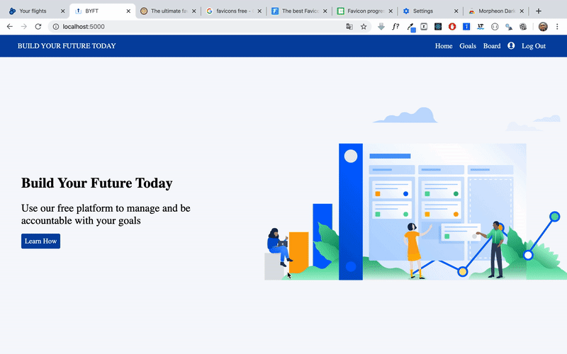
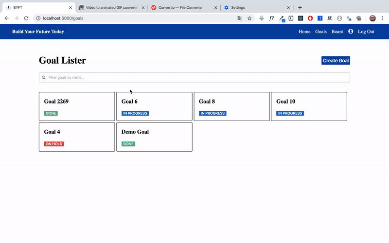
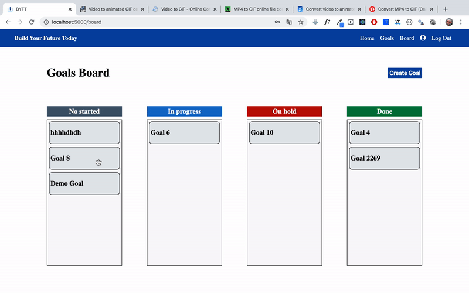
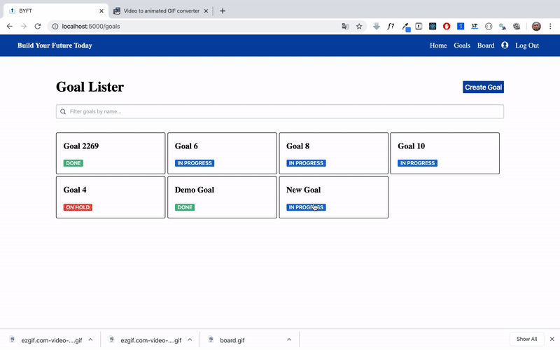

## About 

- Developed a multi-user goal management system that allows users to create goals, create daily tasks for their goals, and keep track of their progress.  
- Incorporated user authentication and drag and drop functionality.  
- Designed and implemented a RESTful Node.js server that the React front-end communicates with.  
- Utilized HTML, CSS, JavaScript, React.js, Node.js/Express, PostgreSQL.  
- Deployed the app to Aws EC2: http://buildyourfuturetoday.me/

**Testing user:** test1, password: 123

### This is not a finish app. These are the TODOs:
- Make it fully mobile friendly
- Add input validation to Login-Register forms and they should be submitted presenting enter and clicking the action button
- Incorporate email notifications
- Add an activity page

## Preview

### Home page

### Goals

### Board

### Tasks

## Running Dev Version

- `git clone` https://github.com/Jeffrey-A/build-your-future-today.git
- `cd /build-your-future-today`
- `npm i`
- `node seed.js`
- `cd /front-end`
- `npm i`
- `npm run build`
- `cd ../`
- `node index.js`
- Go to: http://localhost:5000/
